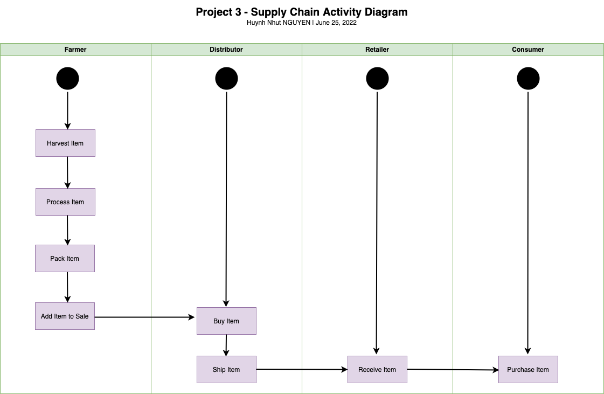
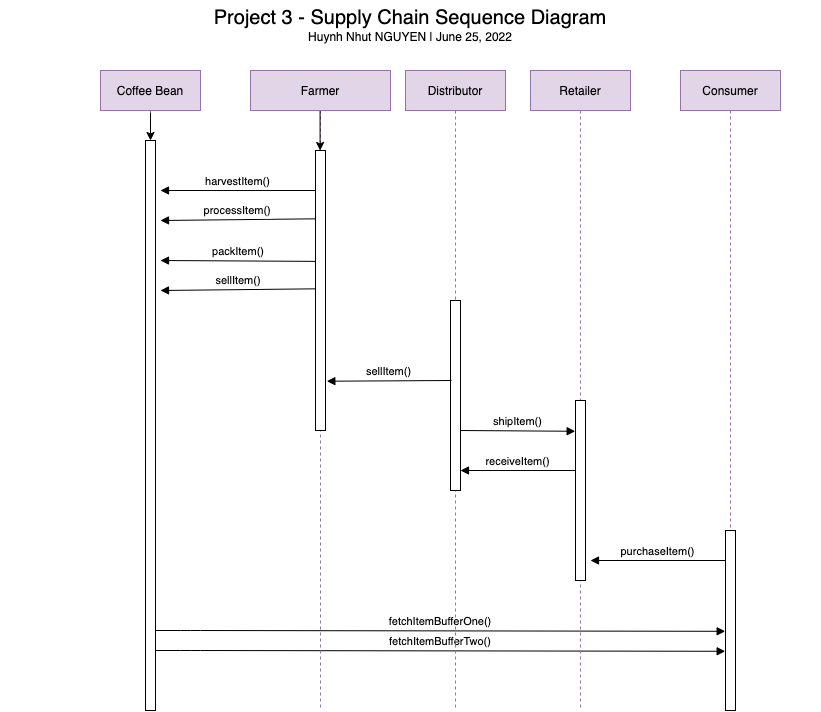
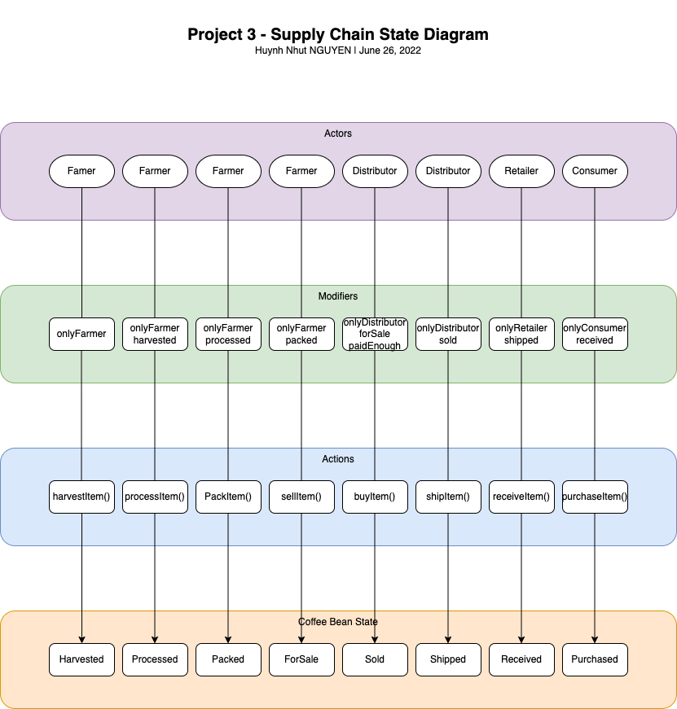
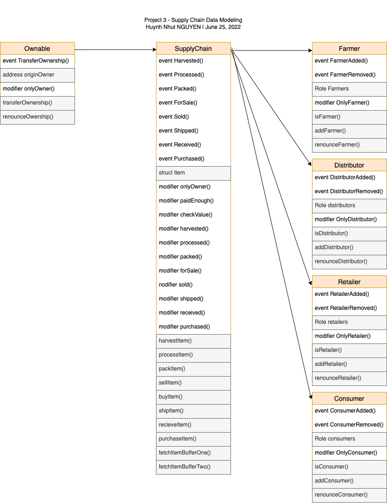

# Fair Trade Coffee Supply Chain

Prove the authenticity of coffee using the Ethereum blockchain.

## Project Write-Up

### UML Diagrams






### Libraries

**Truffle**: Used for developing, testing, and deploying my smart contracts

## Smart Contract

SupplyChain Tx hash: [0xca646fd421a9000d44017ebae555561b479289c6c175a81930dd75370f504e9c](https://rinkeby.etherscan.io/tx/0xca646fd421a9000d44017ebae555561b479289c6c175a81930dd75370f504e9c)<br>
SupplyChain Contract address: [0x2799f3D0d5D12883F3e709b4a841873E16c30203](https://rinkeby.etherscan.io/address/0x2799f3D0d5D12883F3e709b4a841873E16c30203)<br>

### Full Migrations Output

```
Migrations dry-run (simulation)
===============================
> Network name:    'rinkeby-fork'
> Network id:      4
> Block gas limit: 30000000 (0x1c9c380)


1_initial_migration.js
======================

   Deploying 'Migrations'
   ----------------------
   > block number:        10917139
   > block timestamp:     1656212816
   > account:             0xD889770f83350A158CB62DA615c05241a4fe73c9
   > balance:             1.370545808124251072
   > gas used:            226537 (0x374e9)
   > gas price:           10 gwei
   > value sent:          0 ETH
   > total cost:          0.00226537 ETH

   -------------------------------------
   > Total cost:          0.00226537 ETH


2_deploy_contracts.js
=====================

   Deploying 'FarmerRole'
   ----------------------
   > block number:        10917141
   > block timestamp:     1656212823
   > account:             0xD889770f83350A158CB62DA615c05241a4fe73c9
   > balance:             1.367021338124251072
   > gas used:            306684 (0x4adfc)
   > gas price:           10 gwei
   > value sent:          0 ETH
   > total cost:          0.00306684 ETH


   Deploying 'DistributorRole'
   ---------------------------
   > block number:        10917142
   > block timestamp:     1656212828
   > account:             0xD889770f83350A158CB62DA615c05241a4fe73c9
   > balance:             1.363900678124251072
   > gas used:            312066 (0x4c302)
   > gas price:           10 gwei
   > value sent:          0 ETH
   > total cost:          0.00312066 ETH


   Deploying 'RetailerRole'
   ------------------------
   > block number:        10917143
   > block timestamp:     1656212831
   > account:             0xD889770f83350A158CB62DA615c05241a4fe73c9
   > balance:             1.360779898124251072
   > gas used:            312078 (0x4c30e)
   > gas price:           10 gwei
   > value sent:          0 ETH
   > total cost:          0.00312078 ETH


   Deploying 'ConsumerRole'
   ------------------------
   > block number:        10917144
   > block timestamp:     1656212834
   > account:             0xD889770f83350A158CB62DA615c05241a4fe73c9
   > balance:             1.357682818124251072
   > gas used:            309708 (0x4b9cc)
   > gas price:           10 gwei
   > value sent:          0 ETH
   > total cost:          0.00309708 ETH


   Deploying 'SupplyChain'
   -----------------------
   > block number:        10917145
   > block timestamp:     1656212841
   > account:             0xD889770f83350A158CB62DA615c05241a4fe73c9
   > balance:             1.330168098124251072
   > gas used:            2751472 (0x29fbf0)
   > gas price:           10 gwei
   > value sent:          0 ETH
   > total cost:          0.02751472 ETH

   -------------------------------------
   > Total cost:          0.03992008 ETH

Summary
=======
> Total deployments:   6
> Final cost:          0.04218545 ETH


Starting migrations...
======================
> Network name:    'rinkeby'
> Network id:      4
> Block gas limit: 30000000 (0x1c9c380)


1_initial_migration.js
======================

   Deploying 'Migrations'
   ----------------------
   > transaction hash:    0xec5738f7cab33da79618dadf61fe85ec309ee0013aceefc3136089fde7921599
   > Blocks: 1            Seconds: 13
   > contract address:    0x9eddda3740c2A263A006d19D35311E5767A8c8c0
   > block number:        10917147
   > block timestamp:     1656212862
   > account:             0xD889770f83350A158CB62DA615c05241a4fe73c9
   > balance:             1.370545808124251072
   > gas used:            226537 (0x374e9)
   > gas price:           10 gwei
   > value sent:          0 ETH
   > total cost:          0.00226537 ETH

   > Saving migration to chain.
   > Saving artifacts
   -------------------------------------
   > Total cost:          0.00226537 ETH


2_deploy_contracts.js
=====================

   Deploying 'FarmerRole'
   ----------------------
   > transaction hash:    0xf03410e44f8874736e1f66801e1baac6ad4d0dbf55f24a573590ac061dd2e1f8
   > Blocks: 0            Seconds: 5
   > contract address:    0xBfAfC117469c4F890Ce62a37bd18727c58E26Bd4
   > block number:        10917149
   > block timestamp:     1656212892
   > account:             0xD889770f83350A158CB62DA615c05241a4fe73c9
   > balance:             1.367021338124251072
   > gas used:            306684 (0x4adfc)
   > gas price:           10 gwei
   > value sent:          0 ETH
   > total cost:          0.00306684 ETH


   Deploying 'DistributorRole'
   ---------------------------
   > transaction hash:    0x6a6c9106105142e51debbf254b60b20d5d0b5a357d1f712fd8de30569f06dabf
   > Blocks: 1            Seconds: 5
   > contract address:    0xCDeC268AF0E2e8B484F545F2C1415D228dD82144
   > block number:        10917150
   > block timestamp:     1656212907
   > account:             0xD889770f83350A158CB62DA615c05241a4fe73c9
   > balance:             1.363900678124251072
   > gas used:            312066 (0x4c302)
   > gas price:           10 gwei
   > value sent:          0 ETH
   > total cost:          0.00312066 ETH


   Deploying 'RetailerRole'
   ------------------------
   > transaction hash:    0x24da616eabf43ae0b1fc373e546221062d3c1657ce835c7b9570bc487b17d154
   > Blocks: 1            Seconds: 5
   > contract address:    0x0ABB5b99FDb6aEa596f475A483Fa1249c55eDF0a
   > block number:        10917151
   > block timestamp:     1656212922
   > account:             0xD889770f83350A158CB62DA615c05241a4fe73c9
   > balance:             1.360779898124251072
   > gas used:            312078 (0x4c30e)
   > gas price:           10 gwei
   > value sent:          0 ETH
   > total cost:          0.00312078 ETH


   Deploying 'ConsumerRole'
   ------------------------
   > transaction hash:    0x43bf001a7fd474a3b004c3644094ae2a22e38eb05461101e9e0662fedfa67711
   > Blocks: 2            Seconds: 21
   > contract address:    0x35fbC552d258B883B6f567416EbB7cFA6E505C72
   > block number:        10917153
   > block timestamp:     1656212952
   > account:             0xD889770f83350A158CB62DA615c05241a4fe73c9
   > balance:             1.357682818124251072
   > gas used:            309708 (0x4b9cc)
   > gas price:           10 gwei
   > value sent:          0 ETH
   > total cost:          0.00309708 ETH


   Deploying 'SupplyChain'
   -----------------------
   > transaction hash:    0xca646fd421a9000d44017ebae555561b479289c6c175a81930dd75370f504e9c
   > Blocks: 1            Seconds: 9
   > contract address:    0x2799f3D0d5D12883F3e709b4a841873E16c30203
   > block number:        10917154
   > block timestamp:     1656212967
   > account:             0xD889770f83350A158CB62DA615c05241a4fe73c9
   > balance:             1.330168098124251072
   > gas used:            2751472 (0x29fbf0)
   > gas price:           10 gwei
   > value sent:          0 ETH
   > total cost:          0.02751472 ETH

   > Saving migration to chain.
   > Saving artifacts
   -------------------------------------
   > Total cost:          0.03992008 ETH

Summary
=======
> Total deployments:   12
> Final cost:          0.0843709 ETH
```

## Development Notes

Truffle v5.5.19 (core: 5.5.19) <br>
Ganache v7.2.0 <br>
Solidity v0.5.16 (solc-js) <br>
Node v16.15.0 <br>
Web3.js v1.5.3